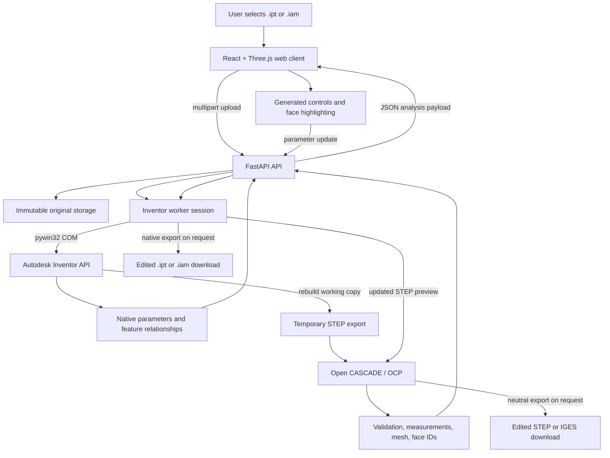

# CAD Parameter Editing Pipeline

## Purpose

This document explains how the application currently processes Autodesk Inventor `.ipt` and `.iam` files, which libraries are used, what each library does, and what is required to extend the same workflow to other CAD systems.

The current implementation is an Inventor-native editing pipeline with an Open CASCADE preview pipeline. It does not use machine learning or screenshot training. Parameter extraction, feature relationships, and preview-face mapping are deterministic operations based on the uploaded CAD document and its geometry.

## Executive summary

For a native Inventor file:

1. The original file is stored unchanged.
2. A working copy is opened through the Autodesk Inventor COM API.
3. Inventor exposes the model parameters and feature relationships.
4. The user edits generated controls in the React interface.
5. Inventor updates and rebuilds the working copy.
6. Inventor exports a temporary STEP representation.
7. Open CASCADE reads and validates that STEP, measures the B-Rep, and creates a preview mesh.
8. React and Three.js refresh the model, values, labels, and highlight state.
9. The user can download the edited native Inventor file or a neutral STEP/IGES file.

The original production file is not overwritten.

## System architecture and data flow



### Component responsibilities

| Layer | Technology | Responsibility | Open source or paid |
|---|---|---|---|
| Browser UI | React, React DOM | Application state, upload UI, parameter controls, status messages | Open source |
| 3D display | Three.js and `OrbitControls` | WebGL model display, orbit, zoom, ray picking, hover/click interaction | Open source |
| UI icons/build | Lucide React and Vite | Icons, frontend bundling, development server, production build | Open source |
| HTTP API | FastAPI, Pydantic, Uvicorn | Uploads, JSON analysis, updates, reset, downloads, errors | Open source |
| Upload handling | `python-multipart` | Reads browser multipart file uploads | Open source |
| Native CAD bridge | `pywin32` + Inventor COM API | Starts/communicates with Inventor, reads parameters, rebuilds, exports | `pywin32` is open source; Autodesk Inventor requires a commercial license |
| CAD geometry kernel | Open CASCADE Technology through `cadquery-ocp` / `OCP` | STEP/IGES import/export, B-Rep topology, validation, bounding boxes, meshing, geometry analysis | Open source, subject to OCCT and package license terms |
| Verification | Pytest and FastAPI TestClient | Automated API, geometry, mapping, and editing tests | Open source |

The application does not use an AI model to infer parameter names. Names such as `Extrusion1 · Distance`, `Loft1 · d45`, and `Hole6 · Hole Diameter` are created from Inventor feature and parameter metadata when that metadata is available.

## Detailed Inventor workflow

### 1. Upload and immutable storage

The browser sends the selected `.ipt` or `.iam` file to FastAPI. The server:

- validates the extension and upload size;
- stores the original bytes as the production source;
- creates a separate native working path;
- associates the upload with a document ID;
- never edits the original bytes.

This gives the application a reset path and protects the customer’s source file from accidental modification.

### 2. Inventor session and parameter extraction

The backend starts a dedicated Inventor worker. The worker uses `pywin32` to call the Autodesk Inventor COM automation interface.

The adapter reads:

- `ComponentDefinition.Parameters.ModelParameters`;
- parameter name, expression, value, units, and comments;
- whether the parameter is independently editable or references another parameter;
- Inventor feature collections such as Extrusion, Revolution, Hole, Fillet, Chamfer, Shell, Loft, Sweep, Rib, and pattern features;
- feature-owned parameter paths, for example extrusion distance, taper angle, hole diameter, fillet radius, or pattern count;
- feature faces, face signatures, feature bounds, and model bounds.

The result is returned as JSON records. The React parameter panel is generated from these records, so the application does not need a hard-coded list of controls for every Inventor model.

### 3. Feature and preview-face relationships

Inventor feature faces and the faces in an exported STEP file do not necessarily have identical IDs. Therefore, the application does not blindly assume that Inventor face number 10 equals OCCT face number 10.

The mapping process compares conservative geometry evidence, including:

- face bounding boxes;
- model and feature bounds;
- surface type;
- face area and related signatures;
- normalized coordinates.

When a safe match is found, the parameter receives `preview_face_ids`. Those IDs are attached to the preview triangles. Hovering the parameter highlights those faces in the Three.js view, and hovering or selecting a preview face displays the mapped feature/parameter label when a relationship exists.

If a safe match cannot be established, the parameter can still be extracted and editable, but the UI reports that a precise preview-face mapping is unavailable. This is safer than highlighting an unrelated surface.

### 4. Parameter update and rebuild

When the user changes a value:

1. React sends the changed values to FastAPI.
2. The Inventor worker applies the values as native Inventor expressions.
3. Inventor performs `Update2`/`Update` and rebuilds the working feature history.
4. Inventor’s STEP translator exports a temporary STEP file.
5. The backend reads the new STEP with Open CASCADE.
6. Open CASCADE validates, measures, triangulates, and returns the new preview mesh.
7. FastAPI returns the updated parameter values, measurements, topology, mesh, and mappings.
8. React replaces the preview and updates the status indicators.

The saving/rebuilding loader is displayed at the top of the 3D preview so the user knows that the model is still being rebuilt.

The backend also compares the new preview geometry against the previous preview. If an expression is accepted by Inventor but does not change the displayed geometry, the update is rejected as a no-op instead of being reported as a successful visible edit.

### 5. Export and download

For a native Inventor source:

- native export returns an edited `.ipt` or `.iam` using the Inventor working document;
- STEP export returns the updated neutral solid;
- IGES export returns an updated neutral exchange file where supported;
- the original uploaded file remains unchanged.

The preview is a STEP-derived OCCT mesh. It is not the Inventor feature tree itself, but it represents the geometry produced by the rebuilt Inventor working copy.

## Open-source and licensing position

The web application, FastAPI layer, React layer, Three.js viewer, Python geometry integration, and automated tests are built with open-source software. The exact obligations depend on the versions and licenses included in the deployment lockfiles.

Autodesk Inventor is different:

- Inventor is proprietary commercial software;
- a valid installation and license/activation are required on the machine running the native worker;
- the Inventor version must be compatible with the files and automation code;
- a production deployment must comply with Autodesk licensing and automation terms;
- Windows is required for this COM-based integration.

Therefore, the neutral STEP/IGES path can be deployed using open-source components, but the native `.ipt/.iam` path has a commercial Autodesk runtime dependency.

## Current production boundaries

The current application supports native Inventor `.ipt` and `.iam` plus STEP/IGES neutral workflows. The following points are important for a production discussion:

- A parameter can be editable without having a reliable one-to-one preview-face mapping.
- Reference, derived, unused, or read-only parameters may not change visible geometry.
- An assembly may require all referenced part files, project paths, content-center data, and external dependencies—not only the `.iam` container.
- A clean, controlled Inventor worker environment is required. Multiple unmanaged Inventor desktop processes can prevent COM startup or cause `Server execution failed` errors.
- CAD rebuilds can take seconds or longer, so requests need timeouts, queueing, cancellation policy, and clear progress status.
- Uploaded CAD files should be treated as untrusted input and processed in an isolated worker with file-size limits, temporary directories, validation, and cleanup.

The application should expose capability status to the user: extracted, editable, preview-mapped, read-only, rebuild failed, or export unavailable.

## Extending the workflow to other CAD systems

Installing another CAD application alone will not automatically make its native feature history available. Each native CAD system needs its own adapter and licensed automation environment.

| Native format | Required native system | Typical automation route | Result |
|---|---|---|---|
| `.ipt`, `.iam` | Autodesk Inventor | Inventor COM/API through `pywin32` | Native parameters, feature rebuild, native export |
| `.sldprt`, `.sldasm` | SOLIDWORKS | SOLIDWORKS API/COM or supported Document Manager capabilities | Requires a separate SolidWorks adapter and license |
| `.CATPart`, `.CATProduct` | CATIA V5/3DEXPERIENCE | CATIA Automation/CAA interfaces | Requires CATIA installation, license, and adapter |
| NX `.prt` | Siemens NX | NX Open | Requires NX installation/license and adapter |
| Creo `.prt`, `.asm` | Creo Parametric | Creo Toolkit/Object TOOLKIT or supported automation | Requires Creo installation/license and adapter |
| STEP, IGES | No vendor CAD required | Open CASCADE readers/writers | Geometry and measurements; original native feature history is normally unavailable |

The repeatable adapter contract should be:

```text
open(source) -> native session
extract_parameters(session) -> parameter and feature records
extract_relationships(session) -> feature/face relationship records
apply_parameters(session, values) -> rebuilt native session
export_preview(session) -> STEP or other neutral preview
export_native(session) -> edited native file
close(session)
```

The frontend can remain mostly unchanged because it already consumes a generic parameter record, mapping status, mesh, and highlight-face list. The backend would select the adapter based on file extension and deployment capability.

## Recommended production strategy

1. **Phase 1 — Inventor native:** support `.ipt/.iam` on dedicated licensed Windows Inventor workers.
2. **Phase 2 — Neutral formats:** support STEP/IGES through OCCT for geometry inspection and controlled free-form operations.
3. **Phase 3 — Demand-driven adapters:** add SolidWorks, CATIA, NX, or Creo only when customers require native feature-history editing for those formats.
4. **Phase 4 — Operations:** add worker queues, isolation, observability, retry rules, model-size limits, dependency packaging for assemblies, and a validation report before download.

This avoids installing and licensing every CAD system before there is a business requirement, while keeping the architecture ready for additional adapters.

## Verification status

The repository includes automated tests for:

- FastAPI upload, update, reset, and download behavior;
- STEP and IGES geometry handling;
- OCCT shape validation and meshing;
- Inventor parameter/feature binding logic;
- preview face-ID and mapping behavior;
- native no-op protection for edits that do not change visible geometry.

The native Inventor path must still be validated on the actual production worker with the licensed Inventor version, representative `.ipt`/`.iam` files, all assembly dependencies, and a clean Inventor process. A successful upload or parameter extraction alone is not proof that every parameter changes visible geometry; the rebuild result and exported file must also be validated.

## References

- [Autodesk Inventor translators and supported file versions](https://help.autodesk.com/cloudhelp/2027/ENU/Inventor-Help/files/GUID-AF41FA87-7588-4698-9C41-756A01EBE7F4.htm)
- [Autodesk Inventor TranslatorAddIn.SaveCopyAs API](https://help.autodesk.com/cloudhelp/2025/ENU/Inventor-API/files/TranslatorAddIn_SaveCopyAs.htm)
- [Open CASCADE Technology](https://www.opencascade.com/open-cascade-technology/)
- [FastAPI](https://fastapi.tiangolo.com/)
- [React](https://react.dev/)
- [Three.js](https://threejs.org/)
